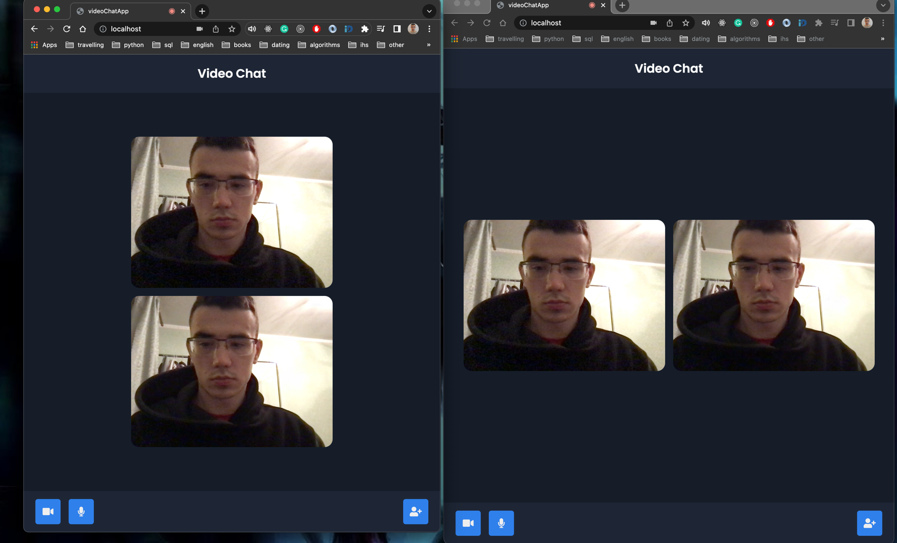
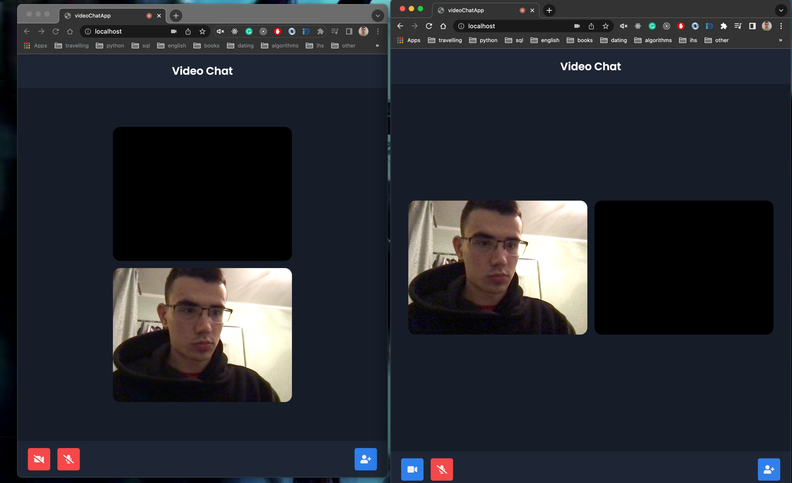

# WEB-RTC practice

[Задепляний додаток](http://192.241.155.57/) - Web-rtc не працює через відсутній SSL сертифікат

## Перший варіант

Реалізовано:

* встановлення RTCPeerConnection між двома вкладками браузера
* можливість вкл/викл камеру та мікрофон
* docker-compose для локального запуску

Використано:

* бразурне Web-rtc API
* [python + python-socketio + uvicorn](app.py) для створення кастомного сигнального сервера
* [js + socket.io](public/script.js) для взаємодії із сигнальним сервером за допомогою WebSocket протокола

Протестувати лакально:

```sh
docker-compose up --build
```

Відкрити `localhost` в двох різних вкладках браузера. Два користувача автоматично будуть з'єднані.



## Другий варіант

Використано:

* бразурне Web-rtc API для роботи з медіа
* [BroadcastChannel](https://developer.mozilla.org/ru/docs/Web/API/BroadcastChannel) для імітації сигнального сервера

Протестувати лакально:

Відкрити `channel/index.html` в двох різнах вкладках браузера.

Два користувача автоматично будуть з'єднані.
